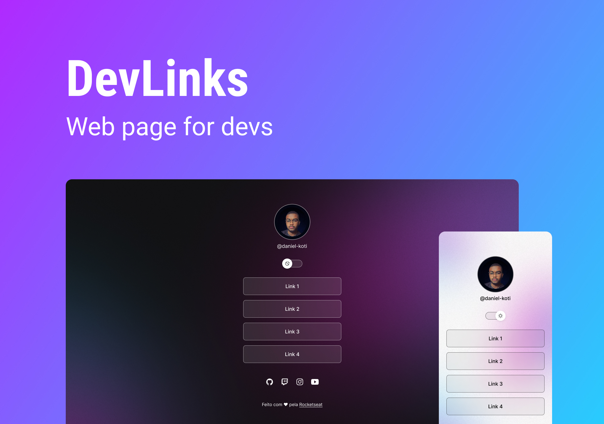

<h1 align="center"> Dev Links 👨🏽‍💻 </h1>

Programa exclusivo e gratuito, promovido pela Rocketseat para ensino de tecnologia WEB.

  <a href="#-tecnologias">Tecnologias</a>&nbsp;&nbsp;&nbsp;|&nbsp;&nbsp;&nbsp;
  <a href="#-projeto">Projeto</a>&nbsp;&nbsp;&nbsp;|&nbsp;&nbsp;&nbsp;
  <a href="#-layout">Layout</a>&nbsp;&nbsp;&nbsp;|&nbsp;&nbsp;&nbsp;

 

  

## 🚀 Tecnologias

Esse projeto foi desenvolvido com as seguintes tecnologias:

- HTML e CSS
- JavaScript
- Git e Github
- Figma

## 💻 Projeto

O Dev Links é um agregador de links para usar como cartão de visitas online.

## 🔖 Layout

Você pode visualizar o layout do projeto através [DESSE LINK](<https://www.figma.com/file/Qgl7ODkDGGnODSLNIdao0N/DevLinks-(Community)?node-id=90%3A160&t=bUWf6iiUuw1lLK4f-0>). É necessário ter conta no [Figma](https://figma.com) para acessá-lo.

Feito com ♥ by Daniel Koti
